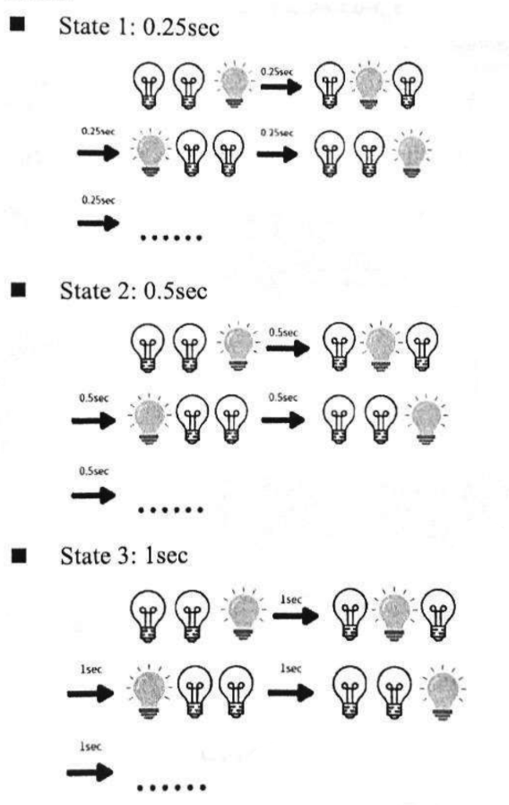
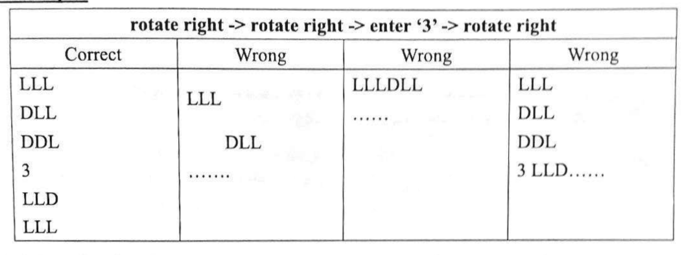

## 2024

### Question 1a

> <mark >LED, button, timer</mark >

Use 3 LEDs lighting sequentially. Push button to change time interval speed.



```
Altering Sequence
Start -> State1
Push button -> State 2
Push button -> State3
Push button -> State1
```

### Question 1b

> <mark >LED, button, timer, UART</mark >

Input 2 numbers via UART. `[state_num] [count_down_start_point] `.
Each state represents the same time interval as 1a does.

```
Input: 2 7
=> Counting down from 7 to 0, with LED changing every 0.5 second.
```

### Question 2a

> <mark >button, servo motor</mark >

Press to change mode:

1. Mode 1: Continuously from +90 to -90 deg, and then reserve.
2. Mode 2: Continuously from +90 to 0 deg, and then reserve..

### Question 2b

> <mark >button, servo motor</mark >

Roate degrees: 45 -> 90 -> 180 -> 45 ...

1. Set initial degree. (e.g. -90)
2. Rotate 45. Current deg = -90+45 = -45
3. Rotate 90. Current deg = -45 + 90 = 45
4. Rotate 180. Current deg = 45 + 180 = -45...

### Question 3a

> <mark >button, servo motor, timer, variable resistor</mark >

Simulate `running light` aka `marquee effect`. The value depends on variable resistor.


### Question 3b

> <mark >button, servo motor, timer, UART, variable resistor</mark >

3a cont.

1. When LEDs' states change, use L and D to represent light and dark, and diaplay via UART.
2. Input integer `X`. The state counter will update by adding a buffer that new state becomes `(state+X)%7`, where `0<X<1e6`



## 2023

### Question 1a

> <mark >LED, variable resistor</mark >

Adjust variable resistor to change state on LED. Each state flashes at different frequency:

- State_1: 1s
- State_1: 0.5s
- State_2: 0.25s

### Question 1b

> <mark >LED, UART, variable resistor</mark >

Same as 1a, but display `State_n count = x ` on UART.

### Question 2a

> <mark >button, servo motor</mark >

Press to change mode:

1. Mode 1: Continuously from -45 to 45 deg, and then reserve.
2. Mode 2: Continuously from -90 to 90 deg, and then reserve.

### Question 2b

> <mark >button, UART, servo motor</mark >

Input on UART to change mode:

1. Mode 1: Continuously from -90 to +90 deg, and then reserve.
2. Mode 2: Continuously from -90 to +90 deg, and then reserve.

### Question 3a

> <mark >servo motor, variable resistor</mark >

Rotate to change angle of servo motor.
Map 0-1023 of VR value to 0-90 degree.

### Question 3b

> <mark >button, UART, servo motor</mark >

val1 from variable resistor.
val2 from UART input.

Display `val1(0-1023) divided by val2(10-600)` on UART.

## 2021

### Qustion 1a (mode1)

> <mark >UART, button, servo motor</mark >

Input `n` on UART. Make it takes `n` steps from -90 to 90 deg. (2n steps from -90 to 90 to -90)
**PRESS button to execute 1 step move**.

### Qustion 1b (mode2)

> <mark >UART, servo motor</mark >

Input `n` on UART. Make it takes `n` steps from -90 to 90 deg. (2n steps from -90 to 90 to -90).
Don't have to press button, able to move automatically.

### Question 2a

> <mark>LED, button</mark>

Press button to toggle LED on/off.

### Question 2b

> <mark>LED, UART, button, timer</mark>

When button is pressed, set LED on, and start timer.

Display timer `Timer: 00` on UART.

When time's up, LED off, and print new line.

## 2020

3 modes.

- Input `mode2` to start problem 2, breathing LED.
- Input `mode3` to start problem 3, count down clock.

### Question 2

> <mark>LED, timer, variable resistor</mark>

Use variable resistor to adjust the period of breathing LED. (0.5s to 2s).

### Question 3

> <mark>button, timer, UART, servo motor</mark>

1. Input via UART to set `tick_step`.
2. Press button to start the timer. (servo motor is set to -90 deg)
3. Counting...
4. When counting to 0, servo motor will be +90 deg.

> like an old clock.
